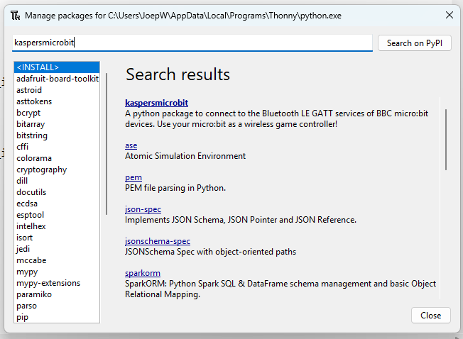

# Avond 3: Pygame

Pygame is een populaire bibliotheek in Python die wordt gebruikt voor het ontwikkelen van 2D-spellen en multimedia-applicaties. Het biedt een breed scala aan functies voor het manipuleren van afbeeldingen, geluiden, en gebruikersinvoer. Pygame is gebouwd op de Simple DirectMedia Layer (SDL). Deze avond gaan we Pygame gebruiken om een DVD logo te laten stuiteren en om Snake te spelen.

## Pygame installeren

Bibliotheken in Python worden "packages" genoemd. Ze bevatten code die je kan hergebruiken in jouw project en worden meestal belangeloos gedeeld door open source ontwikkelaars.
1. Packages zijn via Thonny te installeren via het menu "Tools" -> "Manage packages...":
    
    

2. Zoek naar "pygame":
    
    

3. Klik op het resultaat voor "pygame":
    
    

4. Klik op "install":
    
    

5. Als je dit scherm ziet is pygame succesvol geïnstalleerd:
    
    

Mocht de grafische package manager niet werken, open dan in Thonny -> "Tools" -> "Open System Shell" en voer het volgende commando uit: `pip install pygame`.

## Een eerste programma

```python
import sys, pygame
pygame.init()

size = width, height = 800, 600
speed = [0, 2]
black = 0, 0, 0

screen = pygame.display.set_mode(size)

ball = pygame.image.load("intro_ball.gif")
ballrect = ball.get_rect()

while True:
    for event in pygame.event.get():
        if event.type == pygame.QUIT: sys.exit()

    ballrect = ballrect.move(speed)
    if ballrect.top < 0 or ballrect.bottom > height:
        speed[1] = -speed[1]

    screen.fill(black)
    screen.blit(ball, ballrect)
    pygame.display.flip()
    pygame.time.Clock().tick(60)
```

We beginnen met een simpel programma waar we een bal laten stuiteren. Kopieer de code en sla het op in Thonny. Download het [`intro_ball.gif`-bestand](./intro_ball.gif) van de stuiterende bal en zet het in dezelfde map als je programma.

Eerst zien we dat het importeren en initialiseren van pygame niets bijzonders is. De `import pygame` importeert het pakket met alle beschikbare pygame modules. De oproep naar `pygame.init()` initialiseert elk van deze modules. Op regel 4 stellen we de grootte van het displayvenster in; voor de beste resultaten kun je deze getallen aanpassen aan de resolutie van je eigen monitor. Op regel 8 creëren we een grafisch venster met de oproep naar `pygame.display.set_mode()`. Pygame en SDL maken dit eenvoudig door standaard de beste grafische modi voor de grafische hardware te kiezen. Je kunt de modus overschrijven en SDL zal compenseren voor alles wat de hardware niet kan doen. Pygame vertegenwoordigt afbeeldingen als Surface-objecten. De functie display.set_mode() creëert een nieuw Surface-object dat de daadwerkelijk weergegeven grafische elementen vertegenwoordigt. Elke tekening die je doet op deze Surface wordt zichtbaar op de monitor.

Op regel 10 laden we onze balafbeelding. Pygame ondersteunt een verscheidenheid aan afbeeldingsformaten via de SDL_image bibliotheek, waaronder BMP, JPG, PNG, TGA, en GIF. De functie `pygame.image.load()` geeft ons een Surface met de baldata. De Surface behoudt elke colorkey of alpha-transparantie uit het bestand. Na het laden van de balafbeelding creëren we een variabele genaamd ballrect. Pygame komt met een handig hulpprogramma-objecttype genaamd Rect, dat een rechthoekig gebied vertegenwoordigt. Later, in het animatiegedeelte van de code, zullen we zien wat de Rect-objecten kunnen doen.

Op dit punt, regel 13, is ons programma geïnitialiseerd en klaar om te draaien. Binnen een oneindige lus controleren we op gebruikersinvoer, verplaatsen we de bal, en tekenen we vervolgens de bal. Als je bekend bent met GUI-programmering, heb je ervaring met gebeurtenissen en gebeurtenislussen. In pygame is dit niet anders; we controleren of er een QUIT-gebeurtenis heeft plaatsgevonden. Als dat zo is, verlaten we eenvoudig het programma, pygame zorgt ervoor dat alles netjes wordt afgesloten.

Het is tijd om onze positie voor de bal bij te werken. Regels 17 verplaatsen de `ballrect`-variabele met de huidige snelheid. Regels 18 en 19 keren de verticale snelheid om als de bal buiten het scherm is bewogen. Niet precies Newtoniaanse fysica, maar het is alles wat we nodig hebben.

Op regel 21 wissen we het scherm door het te vullen met een zwarte RGB-kleur. Als je nooit met animaties hebt gewerkt, kan dit vreemd lijken. Je vraagt je misschien af: "Waarom moeten we iets wissen, waarom verplaatsen we de bal niet gewoon op het scherm?" Dat is niet precies hoe computeranimatie werkt. Animatie is niets meer dan een reeks enkele afbeeldingen, die wanneer ze achter elkaar worden weergegeven, het menselijk oog heel goed voor de gek houden om beweging te zien. Het scherm is slechts een enkele afbeelding die de gebruiker ziet. Als we de tijd niet zouden nemen om de bal van het scherm te wissen, zouden we eigenlijk een "spoor" van de bal zien terwijl we de bal continu tekenen op zijn nieuwe posities.

Op regel 22 tekenen we de balafbeelding op het scherm. Het tekenen van afbeeldingen wordt afgehandeld door de Surface.blit() methode. Een blit betekent in feite het kopiëren van pixelkleuren van de ene afbeelding naar de andere. We geven de blit-methode een bron-Surface om van te kopiëren, en een positie om de bron op de bestemming te plaatsen.

De laatste stap die we moeten doen is het daadwerkelijk bijwerken van het zichtbare display. Pygame beheert het display met een dubbel buffer. Wanneer we klaar zijn met tekenen, roepen we de methode pygame.display.flip() aan om het volledige display Surface naar het scherm bij te werken. Dit zorgt ervoor dat alles wat we op de scherm-Surface hebben getekend zichtbaar wordt. Dit bufferen zorgt ervoor dat we alleen volledig getekende frames op het scherm zien. Zonder dit zou de gebruiker de half voltooide delen van het scherm zien terwijl ze worden gemaakt.

Dan moeten we tenslotte nog zorgen dat we het scherm met 60 Frames Per Seconden weergeven. Dit doet de klok op regel 24.

Dat is de korte introductie tot pygame. Pygame heeft ook modules om dingen te doen zoals invoerbeheer voor het toetsenbord, de muis en de joystick. Het kan audio mixen en streaming muziek decoderen. Met de Surfaces kun je eenvoudige vormen tekenen, de afbeelding roteren en schalen, en zelfs de pixels van een afbeelding in realtime manipuleren als numpy-arrays.

## Iets moeilijker: stuiterend DVD logo

Deze introductie opdracht doet me denken aan vroeger, toen we nog DVD-spelers gebruikten. Die hadden een screensaver waar het DVD logo over het scherm stuiterde. Dit logo beweegt niet alleen in verticale richting, maar ook horizontaal! En het was altijd maar afwachten of [die precies in de hoek terecht zou komen](https://www.youtube.com/watch?v=QOtuX0jL85Y). En hoe lang moet je wachten tot alle 4 de hoeken geraakt zijn? [Oneindig lang](https://www.youtube.com/watch?v=vqjc5M0le_s)!

Probeer gerust je programma uit tussen de volgende stappen om te kijken wat er veranderd is.

1. Kopieer het eerste programma naar een nieuw bestand binnen Thonny, zodat we het kunnen hergebruiken.
2. Hernoem `ball` naar `logo` (tip: Ctrl + F is "Find and Replace").
3. Verander het plaatje wat we inladen op regel 10 van `intro_ball.gif` naar [`dvdlogo0.png`](./dvdlogo0.png).
4. De snelheid is momenteel een vector in verticale richting: `[0, 2]` betekent dat de x-as niet wijzigt en de y-as wel. Verander deze vector zodat de x-as ook met 2 pixels per frame verandert.
5. Het terugkaatsen tegen de rand gebeurt door de snelheid negatief te maken zodat het logo weer terug beweegt. De intro_ball had dit alleen voor de y-as, voor het DVD logo willen we dit gedrag ook op de x-as, anders verdwijnt het logo uit het scherm. Welke twee regels code moet je hiervoor kopiëren en aanpassen?
6. De snelheid mag ook wel iets omhoog. Probeer `[4, 4]` eens.

Mocht je willen spieken naar de oplossing, dan kun je die vinden in het bestand [`pygame-dvd.py`](./pygame-dvd.py).

## Nog iets moeilijker: stuiterend DVD logo dat op een willekeurige plek op het scherm begint

Het DVD logo begint nu altijd op coordinaten (0, 0). Dat kunnen we veranderen, zodat die op een willekeurige plek op het scherm begint.

1. Voor willekeurige getallen moeten we de `random` module importeren:

    ```python
    import sys, pygame, random
    ```

2. Voordat we aan de oneindige loop beginnen, maar nadat we het logo gedefinieerd hebben, kunnen we dan een willekeurig start coordinaat voor x berekenen. Hiervoor pakken we een getal tussen de 0 (linkerkant van het scherm) en `width - logo.get_width()`, wat de schermbreedte is min de breedte van het logo, zodat het logo nog wel binnen het scherm past.

    ```python
    start_x = random.randint(0, width - logo.get_width())
    ```

3. Dit moeten we natuurlijk ook voor `start_y` maken, maar dan met de hoogte.
4. En dan willen we eenmalig, vóór de oneindige lus, de `logorect` moven naar de `[start_x, start_y]` coordinaten. Let op dat je het resultaat van `logorect.move()` weer opslaat in de `logorect` variabele. Anders zijn we in de lus alweer vergeten dat we op start_x, start_y moeten beginnen en beginnen we gewoon weer op [0, 0].

Ook van deze stap is de oplossing beschikbaar, zie het bestand `[pygame-dvd-willekeurige-start-plek.py](./pygame-dvd-willekeurige-start-plek.py)`.

## Nog een extra beetje moeilijker: stuiterend DVD logo dat van kleur verandert als de zijkant geraakt wordt

De echte DVD logo screensaver verandert ook nog van kleur als de zijkant geraakt wordt. Er staan 8 verschillende kleuren plaatjes klaar als `dvdlogo0.png` tot en met `dvdlogo7.png`.

1. Voeg de code van de volgende twee stappen in voor het stukje `logo = ...` (regel 10).
2. Laad alle 8 plaatjes in een lijst genaamd `logo_images`: `logo_images = [pygame.image.load(f"dvdlogo{i}.png") for i in range(8)]`. Hier worden twee interessante Python constructies gebruikt: `range(8)` maakt een lijst met getallen van 0 tot 8. De constructie `[X for i in LIJST]` wordt een List Comprehension genoemd en is een korte manier om over alle elementen `i` in lijst `LIJST` te lopen en te transformeren met de functie `X`. In ons geval gaan we dus voor elk element `i` uit de lijst 0 tot 8 het plaatje laden genaamd `dvdlogo{i}.png` en die 8 plaatjes komen dan in de lijst genaamd `logo_images`.
3. Om door de lijst met `logo_images` te lopen gaan we een teller bijhouden genaamd `current_logo_index`. Die begint natuurlijk op `0`.
4. Dan veranderen we de `logo = ...` regel zodat die niet zelf meer het plaatje laadt, maar gebruik maakt van het eerste element uit de lijst met logo_images: `logo = logo_images[current_logo_index]`
5. Op de plek waar we controleren of we de rand raken gaan we twee dingen doen: 1) verhoog de `current_logo_index` (stap 6) en 2) verander het logo met het `current_logo_index` element uit de lijst van `logo_images` (stap 7). Wat is de juiste plek om dit toe te voegen?
6. Het verhogen van de `current_logo_index` met 1 geeft op den duur een probleem. Namelijk na 8 keer stuiteren wordt de `current_logo_index` groter dan de lijst waar doorheen gelopen wordt en dan crasht Python. Eigenlijk willen we dus dat na 8 keer stuiteren, de `current_logo_index` weer op 0 gezet wordt. Dit kun je oplossen met een `if` statement. Maar het is ook een geweldige kans om de modulo operator `%` te gebruiken, die het rest van een deling geeft: `current_logo_index = (current_logo_index + 1) % len(logo_images)`. Waarbij `len(logo_images)` het aantal elementen in de lijst `logo_images` is. Dus mocht je later nog meer kleuren dvd logos toevoegen, dan hoef je alleen de `range(8)` bij het inladen van de images aan te passen en de rest van de code blijft werken met de juiste getallen.
7. Nu het `current_logo_index` geupdate is, moeten we zorgen dat de `logo` variabele geüpdate wordt. Dat gaat met een al bekend stukje code: `logo = logo_images[current_logo_index]`
8. Probeer je programma uit. Verandert de kleur van het logo bij zowel het horizontaal als het verticale stuiteren? Of moet je stap 6 en 7 nog op een andere plek herhalen?

## Snake besturen met de BBC Micro:bit

Bij het afhandelen van de events kun je ook reageren op toetsenbord events. Met de pijltjes toetsen kun je bijvoorbeeld een potje snake spelen als je `[snake.py](./snake.py)` download. Het interessante stuk is in de oneindige lus waar er gekeken wordt of de events die gebeuren een `KEYDOWN` (toets ingedrukt) event zijn, en zo ja, welke toets het is, bijvoorbeeld `K_UP` (pijltje omhoog).

Maar met een toestenbord spelen is [zoooooo 1976](https://en.wikipedia.org/wiki/Snake_(video_game_genre)). Laten we er een beetje 2016 technology tegenaangooien en een Micro:bit gebruiken. 

We moeten een programma op de Micro:bit laden:
1. Download de volgende file: [microbit-bluetooth-accel-buttons-led-temp-no-pairing.hex](https://kaspersmicrobit.readthedocs.io/en/latest/assets/hex/microbit-bluetooth-accel-buttons-led-temp-no-pairing.hex)
2. Sluit je Micro:bit aan op de computer
3. Kopieer in je File Explorer het hex bestandje naar Microbit, die als USB stick in Explorer te vinden is.

Hierna gaan we terug naar Thonny en moeten we het package "kaspersmicrobit" installeren:


1. Maak een kopie van snake.py en voeg de volgende imports toe boven aan het project
```python
from kaspersmicrobit import KaspersMicrobit
from kaspersmicrobit.services.accelerometer import AccelerometerData
from kaspersmicrobit.services.buttons import ButtonState
```

2. We gaan een eigen event toevoegen aan pygame:
```python
ACCEL_EVENT: int = pygame.event.custom_type()
```

3. We moeten een functie hebben die aangeroepen wordt als er data vanaf de Micro:bit binnenkomt:
```python
def post_accelerometer_event(data:AccelerometerData):
    event_dict: dict = {"x": data.x / 1000, "y": data.y / 1000}
    pygame.event.post(pygame.event.Event(ACCEL_EVENT, event_dict))
```

4. Om verbinding te maken met een Micro:bit gebruiken we het volgende stukje code. Dit moet om de oneindige loop heen, dus alles vanaf `while True:` tot het eind moet een extra tabje geïndenteerd worden. 
```python
with KaspersMicrobit.find_one_microbit() as microbit:
```

5. In de `with` knopen we de functie uit stap 3 aan de accelerometer van de Micro:bit
```python
    microbit.accelerometer.notify(post_accelerometer_event)
```

6. Nu moeten we in de event handling naast de knoppen ook ons eigen `ACCEL_EVENT` afhandelen:

```python
            elif e.type == ACCEL_EVENT:
                if e.__dict__["x"] < -.75:
                    direction = 3
                elif e.__dict__["x"] > .75:
                    direction = 1
                elif e.__dict__["y"] < -.75:
                    direction = 2
                elif e.__dict__["y"] > .75:
                    direction = 0
```

En dat is alles! Nu kun je door het kantelen van je micro:bit de slang in snake besturen.

Het volledige programma is hier te vinden: `[snake-microbit.py](./snake-microbit.py)`

## Documentatie

Wat handige links voor als je met PyGame aan de slag gaat:

* [Pygame introduction](https://www.pygame.org/docs/tut/PygameIntro.html)
* [Newbie guide](https://www.pygame.org/docs/tut/newbieguide.html)
* [How to control a pygame program with a micro:bit using Kasper's micro:bit](https://www.youtube.com/watch?v=UsZqoSYZBbU)
